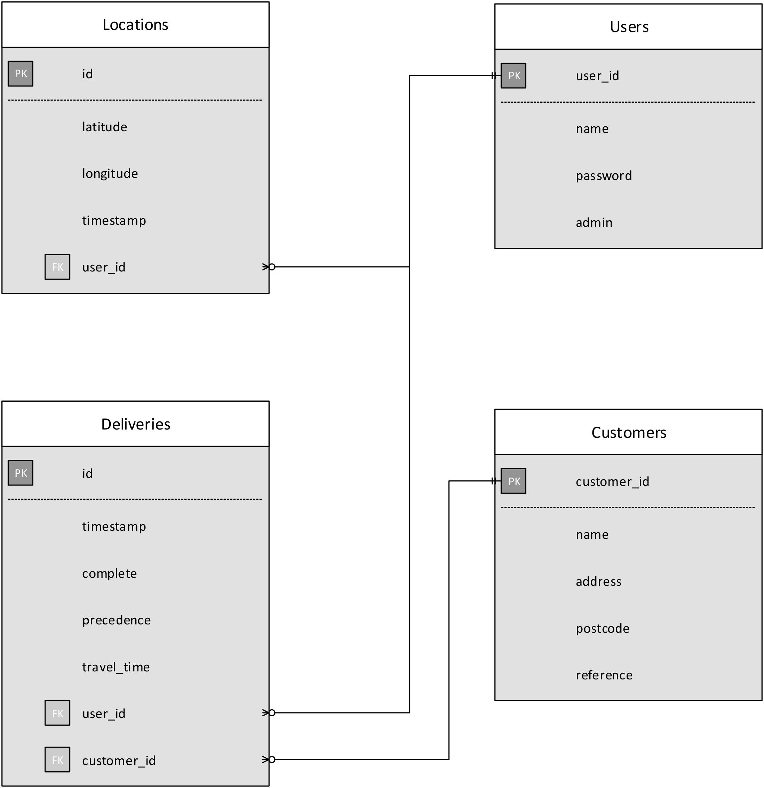

# Thirty Nine Deliveries

## Contents

- [Rails Outline](#rails-outline)
  - [Assets](#assets-appassets)
  - [Models](#models-appmodels)
  - [Controllers](#controllers-appcontrollers)
  - [Views](#views-appviews)
  - [Other](#other)
- [JavaScript](#javascript)
- [CSV Specification](#csv-specification)
- [Setup](#setup)
- [Troubleshooting](#troubleshooting)

## Rails Outline
This section gives an overview of the application taking in the main parts of the Rails architecture.

### Assets `app/assets`

**fonts** contains [Foundation's][foundation] font icons. Used in the navigation bar and on the login screen.

**images** has the map pin images and Ajax loader gif.

**javascripts** are dealt with in the [section](#javascript) below.

**stylesheets** obviously contain the CSS. Two of the files are related to Foundation, and are used for customizing the provided UI elements. The `foundation-icons.scss` file has some code at the top that loads the font icons properly (this isn't done by default).

### Models `app/models`
The entity diagram below shows the models and their associations. These are the *ActiveRecord* backed models. The models have standard database validation expressions applied in order to ensure no invalid data is saved to the database. There is also a model `delivery_loader.rb` not backed by a database. This is used to handle the uploading of files.



Some sample data in the database tables can be seen in `docs/sample_tables.txt`. Some points of interest in the model code are:
- **location.rb** - can alter the number of stored locations, default is last 2 hours.
- **user.rb** - one could remove email validation, in order to use email **as** a username field (without having to rename the attribute).
- **delivery.rb** - can also alter the number of stored records, default to 1 month. The main function calculates the route for a particular user based on todays deliveries. This is stored as precedence or the order in which the drops should be taken.
- **delivery_loader.rb** - this class does the work of receiving the uploaded delivery CSV file and processing and saving it to the database as a list of *deliveries*. More on the CSV file can be found [below](#csv-specification).

### Controllers `app/controllers`

The controllers are mostly standard. The parent `application_controller.rb` has some functions, that are used in other controllers, to enforce user restrictions and perform post log-in tasks.

### Views `app/views`

The **customers** and **users** layouts are fairly straightforward, both with the standard CRUD operations (though you can't create a new customer with any of the customer views).

There is only an index/list view for **deliveries**, it does have two forms one for admin users and one for other users. These partials are contained in `views/layouts`. There is also a json builder view to return json output.

The **delivery_loader** view is a an upload form. An appropriate CSV can be uploaded to create deliveries.

Devise is used for authentication so the **devise** views are available, in order that they can be customized.

The **home** view is the root path and main application view.

The **layouts** directory contains partials used in other views. The main application HTML template is also located here `application.html.erb`.

The HTML view for **locations** are limited to the admin users, and is really just for testing to see what is stored - not for the end-user. There is also json views for latest user locations, these are required for the main application.

### Other
Some of the other files in the rails directory that warrant special attention are mentioned in this section.
- `config/application.rb` contains some global variables used throughout the
application. The name of the company can be set here and is reflected in various parts of the application (e.g. the page titles). A home location is also set here. The Bing Maps API key must also declared in this file (more on this in [setup](#setup)).
- `config/unicorn.rb` is the unicorn server configuration file, this is default one taken from Heroku.
- `config/database.yml` has the PostgreSQL database setup  and config.
- `db/seeds.rb` can seed the database with some sample data, run with `rake db:seed`. This can be useful for testing as it sets up deliveries for the given day without the need to upload a file.
- the `docs` folder contains some information referenced from this document.
- the `lib` folder also contains two important ruby files.
  - **post_code_finder.rb** this is used by the application to reconcile a postcode with a geographic postion.
  - **route_calculator.rb** calculates the delivery routing for the application.
    - there is an option in this file to choose the method of route optimization (distance, traffic, trafficWithTime). This also has to be changed in `app/assets/javascripts/delivery.api.js` in the `calculateLeg` function.
- Some tests are available in the `spec` folder. They use RSpec but are not complete, just covering some of the main rails implementation. JavaScript test using Jasmine are likewise incomplete.
- the `vendor/assets/javascripts/moment.min.js` is used in for some date formatting.
- Heroku uses the `Procfile` to run the web server, it is configured for unicorn.

## JavaScript
Using the Map API and also the geolocation API requires the use of some JavaScript. This located in the `app/assets/javascripts` directory. The main `application.js` file set the other files to load as well as some initializers.

The JavaScript files use the module pattern to provide some structure on the code. The main JavaScript for this application is `delivery.js` this adds some utility functions and event listeners, and calls the map initialization.

The actual map code is in `delivery.map.js` and contains functions to display the map and add pins and lines etc. The `delivery.api.js` file handles communication with the server in order to display relevant information (e.g. deliveries and van locations). The final file `delivery.gps.js` implements the HTML5 geolocation API in order to receive location coordinates from the client device.

## CSV Specification
A CSV file is used to upload the days deliveries. It is expected to conform to the following specification.
It should have 11 columns:

1. **CODE** a company reference code (used to uniquely identify company in database)
2. **NAME** the company name
3. **LINE1** first line of the address
4. **LINE2** second line of the address
5. **LINE3** third line of the address
6. **TOWN**
7. **COUNTY**
8. **POSTCODE**
9. **OUR_REFERENCE** delivery reference number
10. **TAXPOINT_DATE** taxation date
11. **VAN_ID** the van id allocated to deliver this order

A sample CSV file can be found in the docs directory, `delivery_sample.csv`.

## Setup
This section describes the setting up of a local environment, to run the application. This is based on an installation on a fresh ubuntu linux system.

**Rails and PostgreSQL**

Install Ruby with [RVM](https://rvm.io), if not already installed.
```
gpg --keyserver hkp://keys.gnupg.net --recv-keys D39DC0E3
\curl -sSL https://get.rvm.io | bash -s stable
source /home/<your_username>/.rvm/scripts/rvm
rvm install 2.1.2
```
The application is set up to use PosgreSQL, install as shown if necessary.
```
sudo apt-get update
sudo apt-get install postgresql
sudo apt-get install libpq-dev
```
May need to add nodejs for rails javascript.
```
sudo apt-get install nodejs
```

Postgres needs to be setup with a user, easiest to use the currently logged in user.
```
sudo su postgres -c psql
  create user <username> with password '<password>';
  alter user <username> superuser;
  \q
```

Clone or copy the git repository and change to that directory.
```
gem install bundler
bundle install
```

Set up the database tables.
```
rake db:setup
# optionally seed database
rake db:seed
```

[Heroku's Toolbelt](https://toolbelt.heroku.com/) installs the *foreman* tool allowing the application to be run in a production like environment locally, in this case using the unicorn server.
```
foreman start
```
The standard rails development server can equally be used.
```
rails server
```
**Bing Maps**

In order for the maps to work. A Bing Maps API key, from [here][bingkey], must be added to the `config/aplicaiton.rb`.
```ruby
config.deliveries = {
  :bing_maps_key => 'ABCdef...'
}
```

## Troubleshooting

- **rails out of memory:** If a Rails out of memory error occurs, a solution on linux is to create a swap file ([source][swapfile]).
```
sudo dd if=/dev/zero of=/swapfile bs=1024 count=512k > /dev/null
sudo mkswap /swapfile > /dev/null
sudo swapon /swapfile > /dev/null
echo '/swapfile none swap sw 0 0' | sudo tee --append /etc/fstab
sudo chown root:root /swapfile > /dev/null
sudo chmod 0600 /swapfile > /dev/null
```

- **routes messed up:** If routes seem to be messed up, try recalculating manually with the recalc button in mobile view.
- **customer records invalid:** customer sometimes show up as having invalid records even though the postcode is correct, edit>update can solve this
- **heroku deploy failed:** due to Devise secret key error, ensure `.gitignore` file is allowing `config/secrets.yml` to be committed. It can be re-ignored after heroku deploy.

[//]: # "-----Link References-----"
[foundation]: http://foundation.zurb.com/
[bingkey]: http://www.microsoft.com/maps/create-a-bing-maps-key.aspx
[swapfile]: https://www.digitalocean.com/community/tutorials/how-to-add-swap-on-ubuntu-12-04
